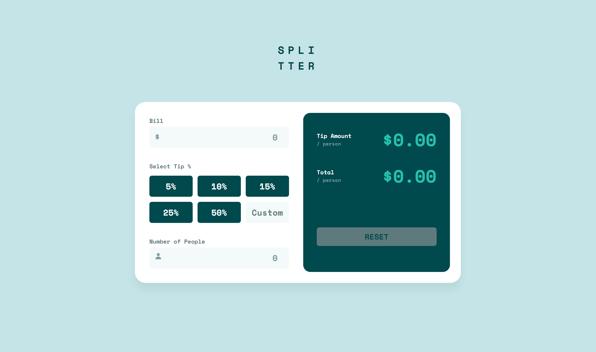

# Frontend Mentor - Tip calculator app solution

This is a solution to the [Tip calculator app challenge on Frontend Mentor](https://www.frontendmentor.io/challenges/tip-calculator-app-ugJNGbJUX). Frontend Mentor challenges help you improve your coding skills by building realistic projects.

## Table of contents

- [Overview](#overview)
  - [The challenge](#the-challenge)
  - [Screenshot](#screenshot)
  - [Links](#links)
- [My process](#my-process)
  - [Built with](#built-with)
  - [What I learned](#what-i-learned)
  - [Continued development](#continued-development)
  - [Useful resources](#useful-resources)
- [Author](#author)
- [Acknowledgments](#acknowledgments)

**Note: Delete this note and update the table of contents based on what sections you keep.**

## Overview

### The challenge

Users should be able to:

- View the optimal layout for the app depending on their device's screen size
- See hover states for all interactive elements on the page
- Calculate the correct tip and total cost of the bill per person

### Screenshot

### Links

- Live Site URL: [Add live site URL here](https://tip-calculator-app-by-kim.netlify.app/)

## My process

### Built with

- Semantic HTML5 markup
- CSS custom properties
- Flexbox
- CSS Grid
- Desktop-first workflow
- javaScript

### What I learned

1.  I learned about placeholders. I learned how to style them and how to inherit the font from the body to use in it(I had a lot of trouble with that).

2.  I learned more about how to use flexbox. At first I couldn't get dimentions right so I was using exact widths to get it to look right. I tinkered with the CSS a lot to not rely on exact widths for every element.

3.  javaScript! I just finished a javaScript course on Udemy and wanted to finish a project all by myself(with the help of Google of course).

One thing I learned from the course that I carried over to this project is to set event listeners on a parent element(the button container) then set a variable to track which button within that element was clicked.

I had absolutely no idea how to change the custom button into an input element. I knew I could hide one element and show another, so that is the strategy I went with. I also found that wrapping the two elements in a div worked well for placing them on top of eachother.

One other thing I struggled with was how to get the form working how I wanted it to work. Maybe I wasn't exactly sure how I wanted it to work at the beginning. Frontend Mentor just gives jpegs for the free version. I ended up making it so that if you hit the enter key it will calculate the tip and total.

### Continued development

1.  complete more difficult javaScript projects

2.  continue to practice HTML and CSS focusing on responsive design

### Useful resources

- [Example resource 1](https://developer.mozilla.org) Can you write javaScript without going to this site at least once? I can't.

- [Example resource 2](https://stackoverflow.com/) Same explanation as MDN.

## Author

- Website - [Kim](https://www.your-site.com)
- Frontend Mentor - [@yourusername](https://www.frontendmentor.io/profile/yourusername)
- Twitter - [@DecodeKim](https://www.twitter.com/decodekim)

## Acknowledgments

My friend helped me out with the CSS sizing a little bit. He can look at the design image and have a good idea what the width of an element is. I'm sure I'll develop that skill after I do more and more projects.

I had trouble with the sizing because the size of the design image and the browser(I used Brave) developer tool sizing didn't match up. My friend helped me by decreasing the browser zoom to 75% and increasing the design image zoom to 150%
